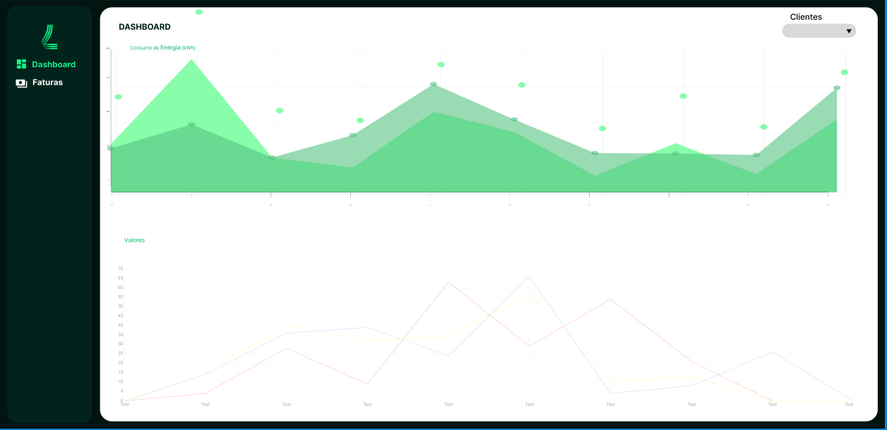
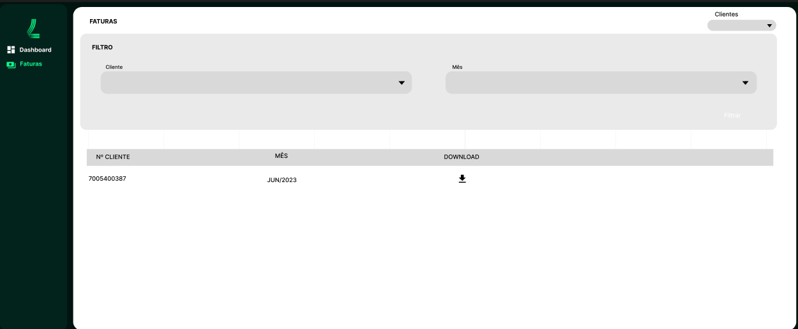
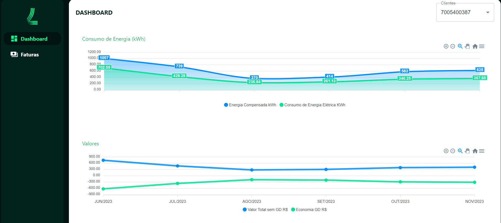
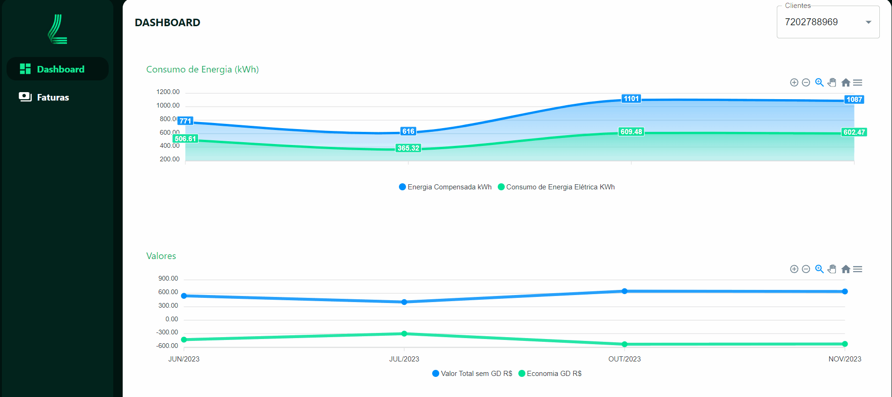
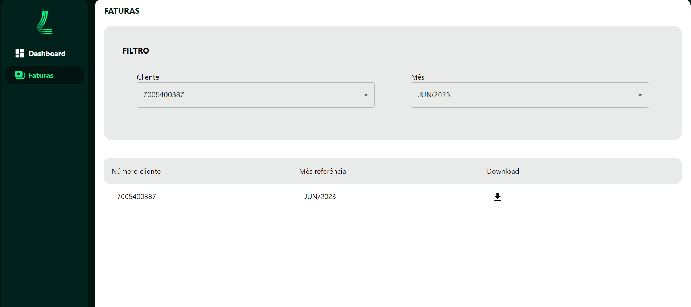

# Frontend

Esta é uma interface para o gerenciamento de dados de faturas de energia elétrica.

## :memo: Descrição

Essa aplicação foi desenvolvido em **[React](https://react.dev/)**, utilizando o framework css **[Tailwind](https://tailwindcss.com/)** para acelerar o processo de desenvolvimento.

## Figma
> [Dashboard](https://www.figma.com/file/nOcLTSeuOmrD49q2Mzjxlc/Lumi-Challenge?type=design&node-id=2%3A2&mode=design&t=xLnlBQ3fCqfKALWb-1)

<br/>

> [Valores](https://www.figma.com/file/nOcLTSeuOmrD49q2Mzjxlc/Lumi-Challenge?type=design&node-id=3%3A2&mode=design&t=xLnlBQ3fCqfKALWb-1)

<br/>

## Ambiente de Desenvolvimento

O projeto foi desenvolvido no seguinte ambiente:

- **Node.js 20.0.1**
- **React 18.2.0**
- **TailwindCss 3.4.0**

<br/>

## Como Executar o Projeto Localmente

> Para isso você precis ter [Node, NPM](https://nodejs.org/en), [Git](https://git-scm.com/) e [Docker](https://www.docker.com/) instalados.


1. Navegue até o diretório do projeto.

```sh
cd front-end
```

<br/>
<br/>

> **OBS:** caso deseje usar o docker siga esses passos:

1. Execute `docker compose up -d` para subir um container.

```sh
docker compose up -d
```

2. Após executar o container a aplicação estará disponível na seguinte url: `http://localhost:3000`.

<br/>
<br/>

> **OBS:** caso não queira usar docker e rodar localmente siga esses passos:


1. Execute `npm install` para instalar as dependências.

```sh
npm install
```

2. Execute `npm run dev` para iniciar o servidor de desenvolvimento.

```sh
npm run dev
```

3. A aplicação estará disponível na seguinte url: `http://localhost:5173`.


<br/>

## :books: Funcionalidades

### Dasbboard por cliente

- **Descrição:** Exibição de dashboard com dados calculados, vinculados a cliente selecionado por filtro.
  <br/><br/>
  
  <br/>
  <br/>
  <br/>
  <br/>

### Biblioteca de faturas

- **Descrição:** Pesquisa fatura por número do cliente e mês de referência.
  <br/><br/>
  
  <br/>
  <br/>
  <br/>
  <br/>

### Download da fatura de energia elética

- **Descrição:** Realiza o download da fatura passando o mês/ano e o Nº do cliente.
  <br/><br/>
  
  <br/>
  <br/>
  <br/>
  <br/>


## :wrench: Tecnologias utilizadas

✔ **[Node](https://nodejs.org/en)**

✔ **[React](https://react.dev/)**

✔ **[Tailwind](https://tailwindcss.com/)**


<br/>


## Contato

[Linked-in](https://www.linkedin.com/in/educoelhos/)

[Email](mailto:eduardocoelhosilva12@gmail.com)
