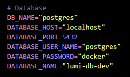

# Node API

Esta é uma api para o gerenciamento de dados de faturas de energia elétrica.

## :memo: Descrição

Etsa api foi desenvolvido em **[Node](https://nodejs.org/en)**, utilizando o framework **[Nestjs](https://nestjs.com/)** para acelerar o processo de desenvolvimento; como SGBD utiliza o **[Postgres](https://www.postgresql.org/)** e para facilitar a manipulação do banco de dado utiliza o **[TypeORM](https://typeorm.io/)**; os teste unitários e de integração forem feitos utilizando o **[Jest](https://jestjs.io/pt-BR/)**.

<br/>

## Ambiente de Desenvolvimento

O projeto foi desenvolvido no seguinte ambiente:

- **Node.js 20.0.1**
- **Nestjs 10.0.0**
- **Postgres 15**

<br/>

## Como Executar o Projeto Localmente

> Para isso você precis ter [Node, NPM](https://nodejs.org/en), [Git](https://git-scm.com/) e [Docker](https://www.docker.com/) instalados.


1. Navegue até o diretório do projeto.

```sh
cd node-api
```

2. Execute `npm install` para instalar as dependências.

```sh
npm install
```

3. Execute `docker compose up -d` para subir um container com o postgres.

```sh
docker compose up -d
```

4. Após certificar-se de que o container com postgres subiu corretamente, execute `npm run migration:run:local` rodara as alterações necessárias no banco de dados.

```sh
npm run migration:run:local
```

5. Execute `npm start` para iniciar o servidor de desenvolvimento.

```sh
npm start
```

6. O servidor estará disponível na seguinte url: `http://localhost:3001`. Caso queira ver a ducumentação e até mesmo testar a api via [Swagger](https://swagger.io/), acesse essa url no navegador: `http://localhost:3001/docs`.

> **OBS:** caso não queira uaser docker e rodar o postgres localmente, atualizar o aquivo .env.local conforme imagem abaixo e rtorno para execução do passo 5



<br/>

## :books: Funcionalidades

### Criar registro de fatura de energia elética

- **Descrição:** Cria um registro com os dados esperados.
  <br/><br/>
  
  <br/>
  <br/>
  <br/>
  <br/>

### Lista todas faturas de energia elética

- **Descrição:** Lista todas faturas de energia elétrica com os campos solicitados na requisição.
  <br/><br/>
  
  <br/>
  <br/>
  <br/>
  <br/>

### Download da fatura de energia elética

- **Descrição:** Realiza o download da fatura passando o mês/ano e o Nº de instalação.
  <br/><br/>
  
  <br/>
  <br/>
  <br/>
  <br/>

### Calculo de todas faturas registradas de um cliente

- **Descrição:** Realiza o calculos de todas faturas reistradas de um cliente.
  <br/><br/>
  
  <br/>
  <br/>
  <br/>
  <br/>

### Calculo das faturas mensais de um cliente

- **Descrição:** Realiza o calculos de todas faturas mensais de um cliente.
  <br/><br/>
  
  <br/>
  <br/>
  <br/>
  <br/>

<br/>

## :wrench: Tecnologias utilizadas

✔ **[Node](https://nodejs.org/en)**

✔ **[Nestjs](https://nestjs.com/)**

✔ **[Postgres](https://www.postgresql.org/)**

✔ **[TypeORM](https://typeorm.io/)**

✔ **[Jest](https://jestjs.io/pt-BR/)**

<br/>

## Arquitetura

O projeto foi desenvolvido na arquitetura limpa (Clean Architecture), tendo bem definida as separação das camadas (domain, application e infra) e com o core da aplicação totalmente desacoplado de bibliotecas externas, para isto, utilizei adapters e conceitos de SOLID como o conceito de inversão de dependências que faz com que os componentes da aplicação não dependam diretamente da implementação, mas somente da interface (contrato firmado entre o código de implementação e o código cliente). Foi utilizado vários design patterns, tais como: [Builder](https://refactoring.guru/pt-br/design-patterns/builder), [Singleton](https://refactoring.guru/pt-br/design-patterns/singleton), [Adapter](https://refactoring.guru/pt-br/design-patterns/adapter), [Composite](https://refactoring.guru/pt-br/design-patterns/composite) entre outros.

<br/>

## Contato

[Linked-in](https://www.linkedin.com/in/educoelhos/)

[Email](mailto:eduardocoelhosilva12@gmail.com)
